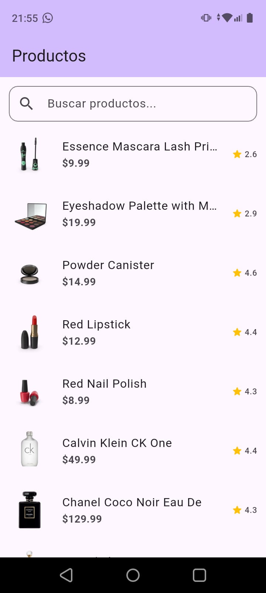
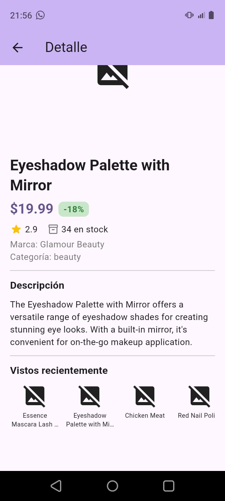
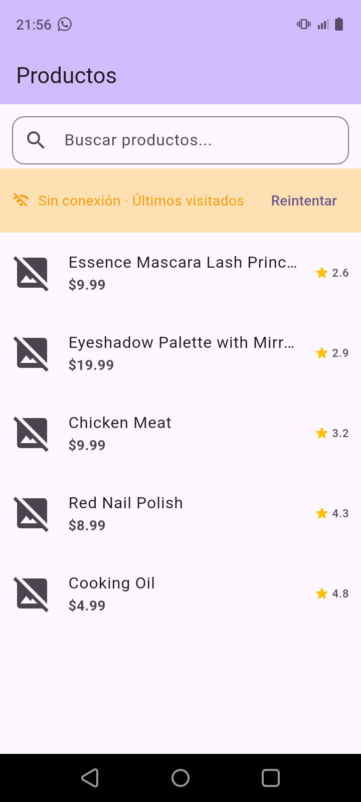

# Flutter Nexus — Prueba Técnica

Aplicación móvil Flutter que consume la API pública [DummyJSON](https://dummyjson.com) para mostrar un catálogo de productos con búsqueda, detalle y soporte offline.

---

## Capturas de pantalla







---

## Requisitos previos

| Herramienta | Versión mínima |
|-------------|----------------|
| Flutter SDK | 3.35.3 (stable)   |
| Dart        | 3.9.2            |
| Android Studio / Xcode | Cualquiera compatible con Flutter 3 |

Comprueba tu entorno:

```bash
flutter doctor
```

---

## Instrucciones para ejecutar

```bash
# 1. Clona el repositorio
git clone <https://github.com/Juan-Papi/flutter-nexus.git>
cd flutter_nexus

# 2. Instala dependencias
flutter pub get

# 3. Ejecuta en el dispositivo/emulador conectado
flutter run

# (Opcional) Build de release para Android
flutter build apk --release
```

> La app no requiere ninguna variable de entorno ni API key. La URL base
> `https://dummyjson.com` está configurada directamente en `DioClient`.

---

## Estructura del proyecto

```
lib/
├── core/
│   ├── errors/          # Sealed class Failure (Server, Cache, Network)
│   ├── network/         # DioClient
│   └── usecases/        # Interfaz base UseCase<Type, Params>
│   └── utils/           # typedefs ResultFuture / ResultVoid
├── features/
│   └── products/
│       ├── data/
│       │   ├── datasources/   # Remote (Dio) + Local (SharedPreferences)
│       │   ├── models/        # ProductModel extiende Product
│       │   └── repositories/  # ProductRepositoryImpl
│       ├── domain/
│       │   ├── entities/      # Product
│       │   ├── repositories/  # Contrato abstracto
│       │   └── usecases/      # GetProducts, Search, Detail, RecentProducts
│       └── presentation/
│           ├── blocs/
│           │   ├── product_bloc/         # Lista + búsqueda
│           │   └── product_detail_bloc/  # Detalle + historial
│           └── pages/
│               ├── home_page.dart
│               └── detail_page.dart
├── app_module.dart   # Módulo raíz (DI global)
├── app_widget.dart   # MaterialApp.router
└── main.dart
```

---

## Decisiones técnicas

### Clean Architecture
Se separó el código en tres capas (Domain, Data, Presentation) para desacoplar la lógica de negocio de los frameworks. El dominio no tiene dependencias externas; la capa de datos implementa los contratos del dominio.

### BLoC + Equatable
`flutter_bloc` maneja el estado de la UI. Todos los estados y eventos extienden `Equatable` para que el framework solo reconstruya widgets cuando el estado cambia por valor, evitando rebuilds innecesarios.
Los BLoCs **no usan try-catch**: reciben `Either<Failure, T>` de los casos de uso y emiten estados de error o éxito según el resultado.

### fpdart — Either para manejo de errores
En lugar de excepciones, el flujo de error usa `Either<Failure, T>` a lo largo de todo el stack (repositorio → caso de uso → BLoC). Esto hace que los posibles fallos sean explícitos en la firma de cada función.

### Modo offline
Cuando la red no está disponible, el BLoC intenta leer los últimos productos visitados del caché local antes de emitir un error. Si hay historial → estado `ProductOffline` con banner naranja + lista navegable. Si no hay historial (primera vez sin red) → estado `ProductError` con el mensaje original.

El detalle también resuelve desde caché: si `getProductDetail` recibe un `DioException`, el repositorio busca el producto en `SharedPreferences` antes de retornar `NetworkFailure`.

### Historial FIFO de 5 productos
`ProductLocalDataSourceImpl` mantiene una lista ordenada por recencia en `SharedPreferences`. Al guardar un nuevo producto: se elimina si ya existía (evita duplicados), se inserta al inicio y, si supera 5 elementos, se descarta el más antiguo.

### flutter_modular
Gestiona inyección de dependencias y navegación declarativa. Los BLoCs se registran como `Bind.factory` (nueva instancia por página) y los repositorios/datasources como `Bind.singleton`.

---

## Posibles mejoras futuras

- **Paginación real** — el endpoint `/products` admite `skip`/`limit`; la UI podría cargar más productos al hacer scroll hasta el final.
- **Caché de imágenes** — integrar `cached_network_image` para que las imágenes estén disponibles offline y no fallen con el `errorBuilder`.
- **Detección proactiva de conectividad** — usar el paquete `connectivity_plus` para escuchar cambios de red y disparar `LoadProducts` automáticamente cuando se recupera la conexión, sin necesidad del botón "Reintentar".
- **Tests** — añadir unit tests para UseCases y BLoCs (con `bloc_test`) y widget tests para las páginas principales.
- **Dark mode** — el `ThemeData` actual sólo define el tema claro; extenderlo con `darkTheme` sería trivial gracias a la separación de capas.
- **Favoritos** — persistir una lista de productos marcados como favoritos, independiente del historial de vistos.
- **Filtros y ordenación** — la API soporta filtrado por categoría; se podría añadir un selector de categorías en la AppBar.
